# NT Sockets & Custom HTTP — Documentation technique


## Vue d'ensemble

Ce projet implémente des requêtes HTTP et HTTPS **sans appeler une seule fonction Win32 haut niveau**
(pas de `socket()`, `connect()`, `send()`, `recv()`, `WinHttpOpen()`…).

Tout repose sur trois couches basses :

```mermaid
graph TD
    A[Application Rust] --> B[NtDeviceIoControlFile\nsyscall NT]
    B --> C[\Device\Afd\nafd.sys]
    C --> D[\Device\Tcp\ntcpip.sys]
    D --> E[Réseau]

    style A fill:#4a4a8a,color:#fff
    style B fill:#2d6a4f,color:#fff
    style C fill:#1b4332,color:#fff
    style D fill:#1b4332,color:#fff
    style E fill:#555,color:#fff
```

---

## 1. Résolution des fonctions — PEB walk + FNV-1a

### Problème

On ne peut pas appeler `GetProcAddress` ou `LoadLibraryA` directement (ce sont déjà des fonctions Win32
qu'on cherche à éviter au démarrage). Au lancement, seul `ntdll.dll` est garanti chargé.

### Solution : PEB walk

Le **Process Environment Block** (PEB), accessible via `gs:[0x60]` sur x64, contient une liste chaînée
de tous les modules chargés dans le processus.

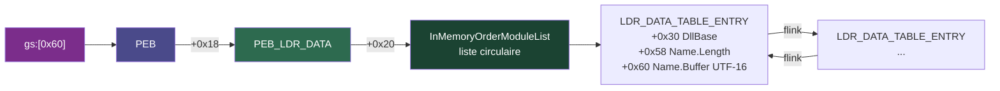

On parcourt cette liste et on compare le nom de chaque DLL à un **hash FNV-1a 32 bits** calculé
à la compilation. Zéro chaîne en dur, zéro import visible.

### Hash FNV-1a

```rust
pub const fn hash_str(s: &str) -> u32 {
    let bytes = s.as_bytes();
    let mut hash: u32 = 0x811c9dc5;   // offset_basis
    let mut i = 0;
    while i < bytes.len() {
        hash ^= bytes[i] as u32;
        hash = hash.wrapping_mul(0x01000193);  // FNV prime
        i += 1;
    }
    hash
}
```

Pour les noms de DLL (UTF-16 dans le PEB), `hash_utf16_lower` normalise d'abord en minuscules.

### Résolution d'une fonction dans un module PE

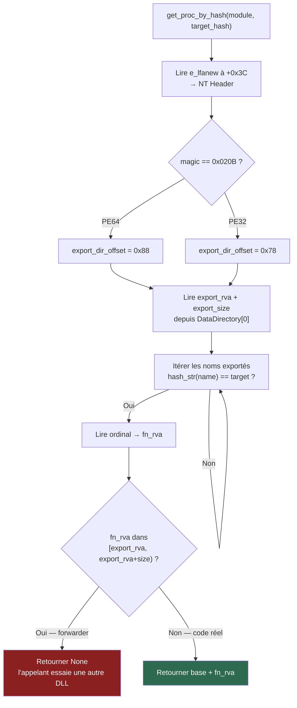

> **Exemple concret** : sur Windows 10/11, `schannel.dll!AcquireCredentialsHandleW` est un forwarder
> vers `sspicli.AcquireCredentialsHandleW`. Sans détection, on transmute la chaîne ASCII en pointeur
> de fonction et on crashe.

---

## 2. Création du socket NT — NtCreateFile + EA buffer

### Principe

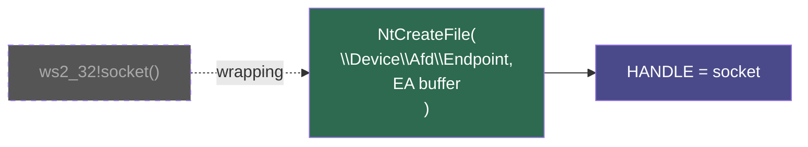

On l'appelle directement avec un **EA buffer** (Extended Attributes) qui décrit le type de socket.

### Format de l'EA buffer (76 octets)

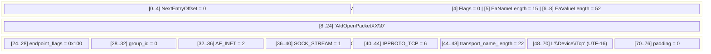

---

## 3. IOCTLs AFD

### Vue d'ensemble des opérations

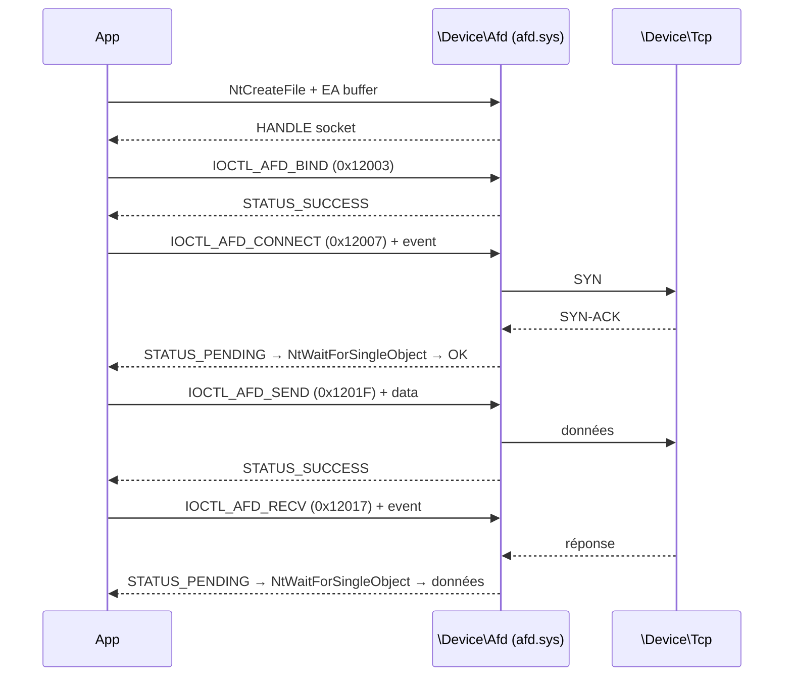

### Modèle asynchrone (event-based)

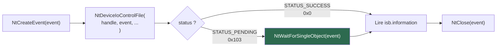

### Structures AFD sur x64 — padding obligatoire

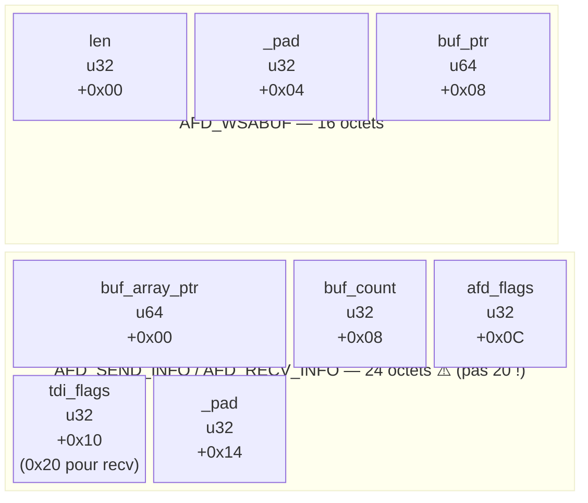

> **Piège** : `InputBufferLength = 20` → `STATUS_INVALID_PARAMETER (0xC000000D)`. Il faut 24.
> Pour `IOCTL_AFD_RECV`, `tdi_flags` **doit** être `TDI_RECEIVE_NORMAL = 0x20`.

---

## 4. Résolution DNS — GetAddrInfoW via ws2_32

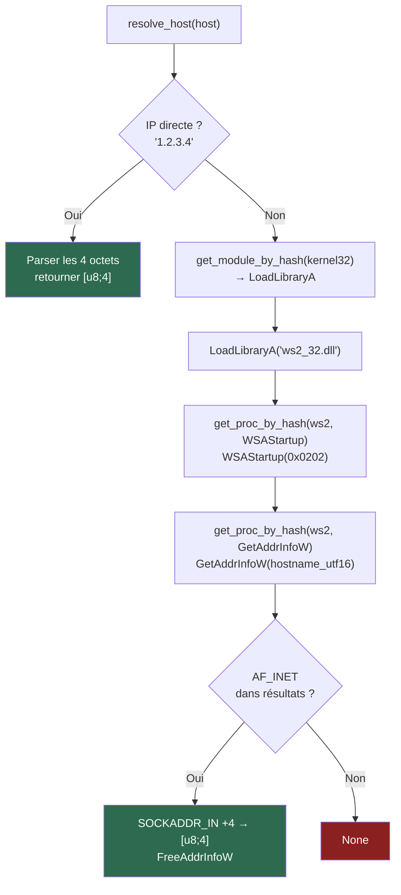

---

## 5. TLS via Schannel

### Résolution des fonctions SSPI — ordre de priorité

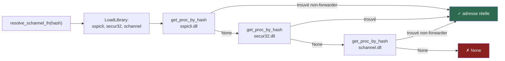

> Sur Win10/11, `sspicli.dll` contient les vraies implémentations.
> `schannel.dll` et `secur32.dll` redirigent via forwarders PE.

### SCHANNEL_CRED v4 — layout x64 (80 octets)

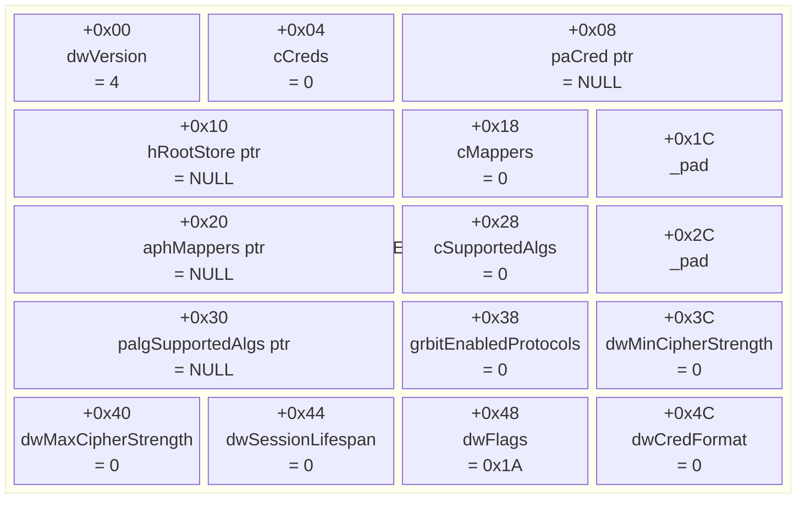

`dwFlags = 0x08 (MANUAL_CRED_VALIDATION) | 0x02 (NO_DEFAULT_CREDS) | 0x10 (NO_SERVERNAME_CHECK)`

> Ne pas utiliser `dwVersion = 5` (SCH_CREDENTIALS) : layout différent, plus grand,
> champs intermédiaires manquants → hang silencieux dans `AcquireCredentialsHandleW`.

### Boucle de handshake TLS

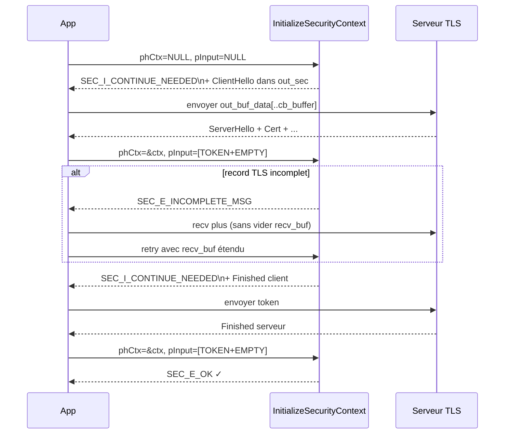

**Règles critiques :**
- `pInput` : toujours **2 SecBuffer** — `SECBUFFER_TOKEN` + `SECBUFFER_EMPTY`. Avec un seul, ISC retourne `SEC_E_INVALID_TOKEN`.
- Ne **pas** utiliser `ISC_REQ_ALLOCATE_MEMORY` si tu envoies depuis ton propre buffer. Avec ce flag, Schannel alloue son buffer interne → `out_sec.pv_buffer` ≠ `out_buf_data` → tu envoies des zéros → le serveur répond par un TLS Alert → `SEC_E_INVALID_TOKEN`.
- `SECBUFFER_EXTRA (type=5)` en sortie d'ISC : octets non consommés à préserver pour la prochaine itération.

### Chiffrement / déchiffrement

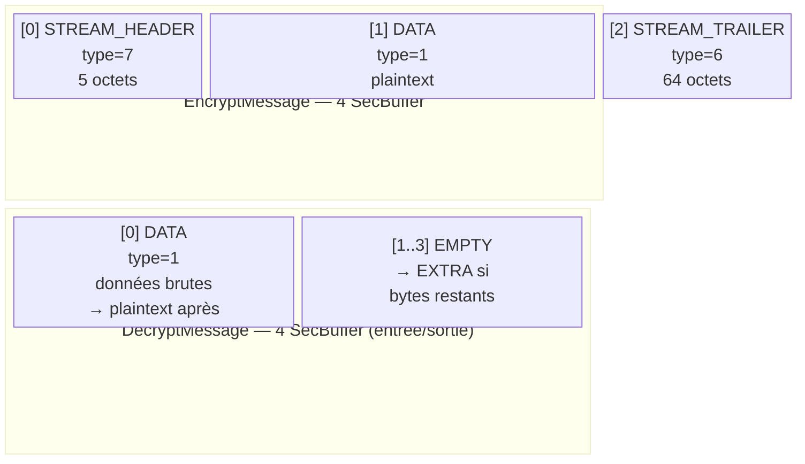

---

## 6. Flux HTTP/HTTPS complet

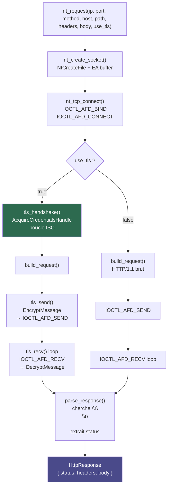

---

## 7. Tableau des codes d'erreur rencontrés

| Code NTSTATUS    | Nom                      | Cause fréquente dans ce code                                           |
|------------------|--------------------------|------------------------------------------------------------------------|
| `0xC000000D`     | STATUS_INVALID_PARAMETER | Buffer AFD 20 octets au lieu de 24 ; `tdi_flags=0` pour recv           |
| `0x00000103`     | STATUS_PENDING           | Normal — IOCTL async, attendre avec `NtWaitForSingleObject`            |
| `0x80090308`     | SEC_E_INVALID_TOKEN      | Envoi de zéros (piège `ISC_REQ_ALLOCATE_MEMORY`) ; 1 seul SecBuffer en entrée ISC |
| `0x80090318`     | SEC_E_INCOMPLETE_MSG     | Record TLS partiel — lire plus sans vider `recv_buf`                   |
| `0x00090312`     | SEC_I_CONTINUE_NEEDED    | Normal — handshake en cours, envoyer token et continuer                |

---

## 8. Utilisation du module

### API publique (`nt_http.rs`)

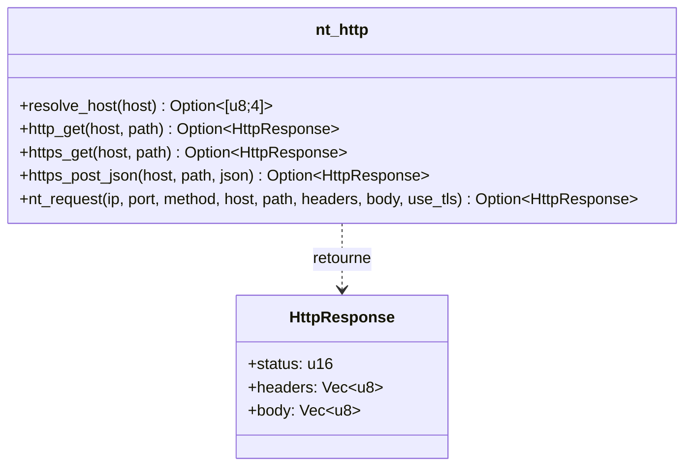

Toutes les fonctions sont `unsafe`.

### Exemples d'utilisation

#### GET HTTP simple

```rust
unsafe {
    match nt_http::http_get("example.com", "/") {
        Some(r) => println!("status={} body_len={}", r.status, r.body.len()),
        None    => println!("échec"),
    }
}
```

#### GET HTTPS

```rust
unsafe {
    match nt_http::https_get("example.com", "/") {
        Some(r) => {
            println!("status={}", r.status);
            println!("{}", String::from_utf8_lossy(&r.body));
        }
        None => println!("échec TLS"),
    }
}
```

#### POST JSON en HTTPS

```rust
unsafe {
    let payload = br#"{"key":"value"}"#;
    match nt_http::https_post_json("api.example.com", "/endpoint", payload) {
        Some(r) => println!("status={} body={:?}", r.status, r.body),
        None    => println!("échec"),
    }
}
```

#### Headers personnalisés (via `nt_request`)

```rust
unsafe {
    let ip = nt_http::resolve_host("api.example.com")?;
    let r = nt_http::nt_request(
        ip, 443, "POST", "api.example.com", "/upload",
        &[
            ("Authorization", "Bearer TOKEN"),
            ("Content-Type",  "application/octet-stream"),
        ],
        b"<binary data>",
        true,
    )?;
    println!("status={}", r.status);
}
```

#### IP directe (sans DNS)

```rust
unsafe {
    let ip = [1, 1, 1, 1];
    let r = nt_http::nt_request(ip, 80, "GET", "1.1.1.1", "/", &[], &[], false)?;
}
```

### Compilation

Ce projet cible **Windows x64** exclusivement. La compilation se fait depuis Linux/WSL via la toolchain `x86_64-pc-windows-gnu` :

```bash
# Debug
cargo build --target x86_64-pc-windows-gnu

# Release
cargo build --release --target x86_64-pc-windows-gnu

# Vérifier la compilation des tests sans les exécuter
cargo test --target x86_64-pc-windows-gnu --no-run
```

> Le binaire produit est un `.exe` dans `target/x86_64-pc-windows-gnu/debug/` ou `release/`.  
> Aucune dépendance externe — `[dependencies]` reste vide dans `Cargo.toml`.

### Intégrer dans un autre projet

1. Copier `src/nt_http.rs`, `src/resolve2.rs`, `src/types.rs`, `src/utils.rs`.
2. Déclarer les modules dans `main.rs` / `lib.rs` :
   ```rust
   mod nt_http;
   mod resolve2;
   mod types;
   mod utils;
   ```
3. Appeler depuis un bloc `unsafe` :
   ```rust
   use crate::nt_http;
   unsafe {
       let r = nt_http::https_get("example.com", "/").unwrap();
   }
   ```
4. Aucune dépendance externe — `Cargo.toml` reste vide.

### Limitations connues

| Limitation | Détail |
|------------|--------|
| IPv4 uniquement | `resolve_host` ne traite que `AF_INET`. IPv6 non supporté. |
| Pas de redirection | Les 301/302 ne sont pas suivis automatiquement. |
| Pas de chunked decoding | Le body est brut ; à décoder manuellement si `Transfer-Encoding: chunked`. |
| Recv partiel (HTTP) | `nt_recv_raw` s'arrête au premier chunk TCP. Peut manquer des données sur les grosses réponses. |
| Pas de vérif. certificat | `SCH_CRED_MANUAL_CRED_VALIDATION` activé. À implémenter via `QueryContextAttributesW(SECPKG_ATTR_REMOTE_CERT_CONTEXT)` si besoin. |

---

## 9. Guide d'utilisation

### Prérequis

| Prérequis | Détail |
|-----------|--------|
| **Rust** | Edition 2024 minimum (`edition = "2024"` dans `Cargo.toml`) |
| **Target Windows x64** | `rustup target add x86_64-pc-windows-gnu` |
| **Exécution** | Le binaire doit tourner sur **Windows x64** — pas de support Linux/macOS/ARM |
| **Pas de dépendances** | `[dependencies]` reste vide |

### Intégrer dans un projet existant

**Étape 1 — Copier les 4 fichiers source**

```
src/
  nt_http.rs    ← logique HTTP/HTTPS
  resolve2.rs   ← résolution PE + PEB walk
  types.rs      ← structures Windows
  utils.rs      ← helpers PEB / UTF-16
```

**Étape 2 — Déclarer les modules**

```rust
// main.rs ou lib.rs
mod nt_http;
mod resolve2;
mod types;
mod utils;
```

**Étape 3 — Appeler depuis un bloc `unsafe`**

```rust
use crate::nt_http;

fn main() {
    unsafe {
        let r = nt_http::http_get("example.com", "/").unwrap();
        println!("{}", r.status);
    }
}
```

---

### Choisir la bonne fonction

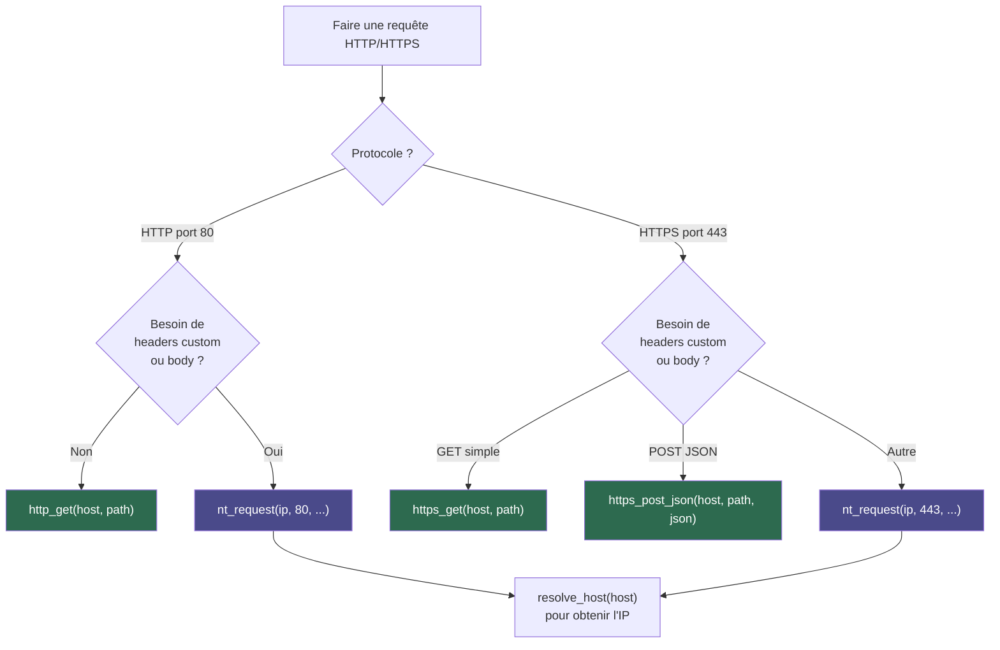

---

### Gestion des erreurs

Toutes les fonctions retournent `Option<HttpResponse>` — `None` indique un échec réseau ou TLS, jamais une erreur HTTP (un 404 est un succès réseau).

```rust
unsafe {
    match nt_http::https_get("example.com", "/") {
        None => {
            // Échec : DNS, connexion TCP, handshake TLS
            // Pas de détail d'erreur exposé — vérifier les prints [DEBUG]
        }
        Some(r) if r.status != 200 => {
            // Connexion réussie, mais le serveur répond avec une erreur HTTP
            println!("HTTP {}", r.status);
        }
        Some(r) => {
            // Succès
            println!("{}", String::from_utf8_lossy(&r.body));
        }
    }
}
```

---

### Lire le body

**Texte (JSON, HTML…)**

```rust
let text = String::from_utf8_lossy(&r.body);
println!("{}", text);
```

**Binaire**

```rust
let bytes: &[u8] = &r.body;
std::fs::write("output.bin", bytes).unwrap();
```

**Lire un header précis**

Les headers sont dans `r.headers` (tout le bloc jusqu'à `\r\n\r\n`) :

```rust
let headers = String::from_utf8_lossy(&r.headers);
for line in headers.lines() {
    if line.to_lowercase().starts_with("content-type:") {
        println!("{}", line);
    }
}
```

> **Transfer-Encoding: chunked** — le body brut contient les tailles de chunks en hexadécimal.
> À décoder manuellement si le serveur utilise ce mode.

---

## 10. Pertinence en cyber offensive — Bypass AV/EDR

### Pourquoi les AV/EDR interceptent le réseau

Les solutions de sécurité modernes (EDR, AV, NDR) instrumentent le processus cible en **hookant les fonctions Win32 haut niveau** dans l'espace utilisateur. Elles injectent leurs DLL ou modifient les premiers octets (`jmp` hook) des fonctions exposées par `ws2_32.dll`, `winhttp.dll`, `wininet.dll` pour intercepter tout trafic réseau avant qu'il ne parte.

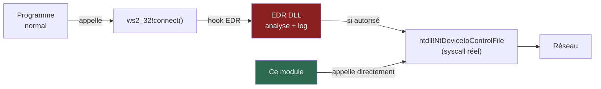

Ce module **court-circuite entièrement la couche hookée** en appelant directement `NtDeviceIoControlFile` via `ntdll.dll`.

---

### Techniques de bypass utilisées

#### 1. PEB Walk — Résolution sans `GetProcAddress`

`GetProcAddress` et `LoadLibraryA` sont des fonctions Win32 fréquemment hookées ou surveillées. Les importer statiquement laisse des traces visibles dans l'**IAT** (Import Address Table) du binaire, analysée par tout scanner statique.

Ce module ne les importe jamais statiquement. Il résout les adresses en parcourant directement la liste des modules dans le PEB (`gs:[0x60]`), structure noyau inaccessible aux hooks user-land.

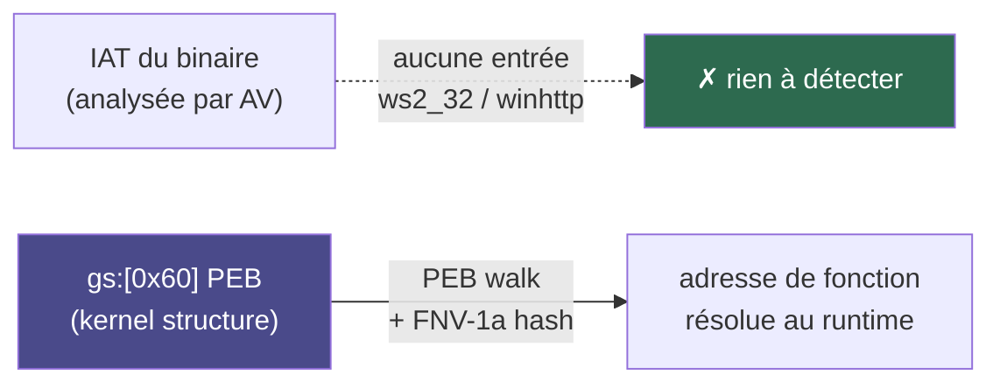

#### 2. Hash FNV-1a — Pas de chaînes en clair

Les noms de fonctions (`NtDeviceIoControlFile`, `AcquireCredentialsHandleW`…) n'apparaissent **jamais en clair** dans le binaire compilé. Seul leur hash 32 bits est présent. Les règles YARA et les scans de strings ne trouvent rien.

```
# Scan de strings naïf → rien
strings custom_http.exe | grep -i "NtDevice"  → (vide)
strings custom_http.exe | grep -i "connect"   → (vide)
```

#### 3. Direct Syscall via AFD — Bypass des hooks Winsock

Même si un EDR hook `ntdll!NtDeviceIoControlFile`, la surface d'attaque est réduite : un seul syscall générique pour toutes les opérations réseau, contre des dizaines de fonctions Winsock/WinHTTP chacune hookable individuellement.

Les solutions les plus avancées peuvent aussi déclencher les syscalls NT directement (syscall stub) pour éviter même le hook sur ntdll — ce module est structuré pour faciliter cette évolution.

#### 4. TLS natif via Schannel — Pas de librairie TLS tierce

Utiliser une librairie TLS embarquée (OpenSSL, mbedTLS…) est une signature statique forte. Ce module délègue le TLS à `schannel.dll` (composant Windows signé Microsoft), résolu dynamiquement par hash. Le trafic HTTPS produit est indiscernable d'un navigateur légitime.

#### 5. Pas d'import Win32 réseau — IAT propre

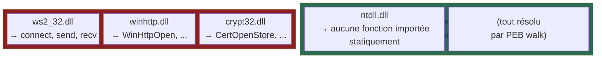

---

### Résumé des surfaces évitées

| Vecteur de détection | Binaire classique | Ce module |
|---|---|---|
| Imports IAT (`ws2_32`, `winhttp`) | Visibles | Absents |
| Strings en clair (noms de fonctions) | Visibles | Hachés FNV-1a |
| Hooks Winsock (EDR user-land) | Interceptés | Contournés |
| Hooks WinHTTP / WinInet | Interceptés | Non utilisés |
| Signature librairie TLS tierce | Possible | Absent (Schannel natif) |
| Appel `GetProcAddress` visible | Oui | Non |

---

## Disclaimer

> **Ce module est fourni à des fins strictement éducatives et de recherche en sécurité.**
>
> Les techniques décrites (PEB walk, résolution dynamique par hash, appels NT directs, bypass de hooks user-land) sont documentées publiquement dans la littérature académique et les conférences de sécurité (Black Hat, DEF CON, OffSec). Leur présentation ici vise à comprendre le fonctionnement interne de Windows et des mécanismes de défense.
>
> **L'utilisation de ce code sur des systèmes sans autorisation explicite et écrite du propriétaire est illégale** dans la plupart des juridictions (CFAA aux États-Unis, directive NIS2 en Europe, loi Godfrain en France…).
>
> L'auteur décline toute responsabilité quant à un usage malveillant, non autorisé ou illégal de ce code. Tout test doit être réalisé dans un environnement isolé, sur des systèmes vous appartenant ou dans le cadre d'un engagement de pentest contractuellement encadré.
